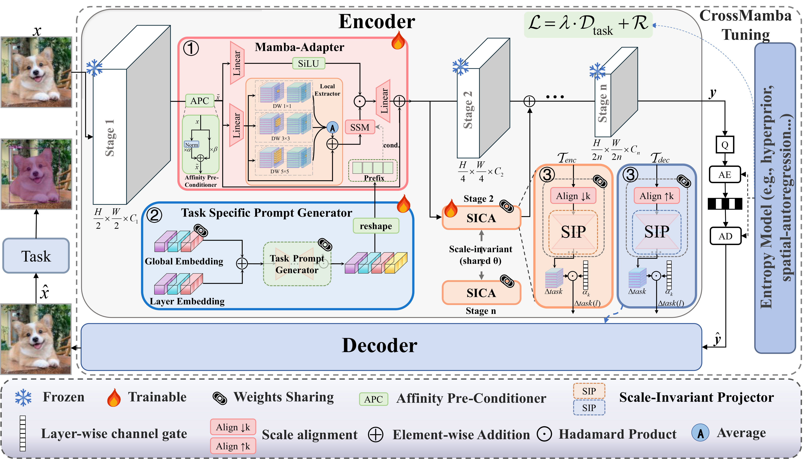
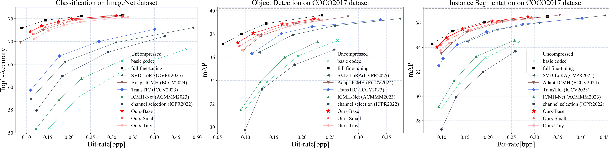

<div align="center">

# 🌟 CrossMambaTuning: Synergistic Spatial and Cross-Layer Adaptation for Machine Vision Compression (ACM MM'26)

**_Synergistic Spatial and Cross-Layer Adaptation for Machine Vision Compression!_**

[](https://arxiv.org/abs/2608.25568)
[](https://github.com/rsr1123/CrossMambaTuning)
[](https://github.com/rsr1123/CrossMambaTuning)
[](https://github.com/rsr1123/CrossMambaTuning/blob/main/LICENSE)

**Haobo Xiong**, Shaobo Liu, Kai Liu, Chongyang Ding*

*Corresponding author


</div>

## 📌 Abstract

To reduce deployment cost and retraining overhead, adapting pre-trained learned image compression (LIC) models to downstream machine vision tasks has attracted growing attention. However, existing methods typically insert fine-tuning modules independently into frozen backbones, lacking explicit mechanisms for cross-layer coordination. To address this limitation, we propose a novel framework named **CrossMambaTuning**, which integrates State Space Models with cross-layer interaction mechanisms for parameter-efficient fine-tuning. Specifically, we design an efficient Mamba adapter equipped with task-specific prompts and multi-scale branches to precisely capture both local features and global dependencies. Furthermore, we introduce a Scale-Invariant Cross-Layer Adapter (SICA) with a parameter-sharing strategy to fuse task information across different scales and reduce redundancy. Extensive experiments demonstrate that CrossMambaTuning achieves strong performance on multiple machine vision tasks with a small trainable parameter budget.

## 🎯 Highlights

✅ **Mamba Adapter**: Task-specific prompts and multi-scale branches for local and global spatial modeling.<br>
✅ **Cross-Layer Adaptation**: Scale-Invariant Cross-Layer Adapter (SICA) fuses task information across scales with parameter sharing.<br>
✅ **Parameter-Efficient Tuning**: Lightweight adaptation of pre-trained learned image compression models.<br>

## 🕒 Updates

[TODO] Release Tiny/Small network and test code.<br>
[TODO] Release training code and pretrained weights.<br>
[2026/08/01] Initial release of the network architecture and experiment configurations.<br>

## 🚀 Overview

<div align="center">

</div>

The current release provides the CrossMambaTuning network architecture and task configurations. Test code, training code, and pretrained weights will be released in subsequent updates.

## 📊 Experimental Results

<div align="center">

</div>

Performance comparison on image classification, object detection, and instance segmentation using TIC as the base codec. We report BD-acc/mAP; the best and second-best results are highlighted in **bold** and <u>underline</u>, respectively.

| Method | Venue | Classification<br>BD-acc ↑ | Detection<br>BD-mAP ↑ | Segmentation<br>BD-mAP ↑ | Trainable Params ↓ (M) |
| --- | --- | ---: | ---: | ---: | ---: |
| Full fine-tuning | — | 17.688 | 4.511 | 3.755 | 7.51 (100.00%) |
| Channel Selection | ICPR'22 | 6.278 | -0.550 | -0.949 | 0.92 (12.25%) |
| ICMH-Net | ACM MM'23 | 3.360 | 0.625 | 0.654 | 3.98 (53.00%) |
| TransTIC | ICCV'23 | 9.956 | 2.768 | 2.690 | 1.62 (21.57%) |
| Adapt-ICMH | ECCV'24 | 16.901 | 3.547 | 3.208 | 0.29 (3.86%) |
| SVD-LoRA | CVPR'25 | 7.920 | 2.207 | 1.938 | <u>0.09 (1.20%)</u> |
| Ours-Tiny | — | 16.118 | 3.742 | 3.266 | **0.08 (1.07%)** |
| Ours-Small | — | <u>16.934</u> | <u>3.980</u> | <u>3.426</u> | 0.15 (2.00%) |
| Ours-Base | — | **17.575** | **4.249** | **3.624** | 0.32 (4.26%) |

## 📚 Libraries & Dataset

All library versions are listed in `requirements.txt`. For the `selective_scan` dependency, please follow the installation instructions of [VMamba](https://github.com/MzeroMiko/VMamba).

**Datasets**

The following datasets are used in the paper:

- COCO2017 Train/Val for detection and instance segmentation
- Kodak for reconstruction evaluation
- ImageNet for classification

## 📥 Inference: onlyTest

Test / inference code and model checkpoints will be released in a future update.

## 🧩 Example: Train/Eval/Test

Training code and complete reproduction instructions will be released in a future update.

## ⚡ Acknowledgment

Our work is based on the framework of [CompressAI](https://github.com/InterDigitalInc/CompressAI) and [VMamba](https://github.com/MzeroMiko/VMamba).
## 📖 Citation

If you find our work useful in your research, please cite our paper:

```bibtex
@article{xiong2026crossmambatuning,
  title={CrossMambaTuning: Synergistic Spatial and Cross-Layer Adaptation for Machine Vision Compression},
  author={Xiong, Haobo and Liu, Shaobo and Liu, Kai and Ding, Chongyang},
  journal={arXiv preprint arXiv:2608.25568},
  year={2026}
}
```
